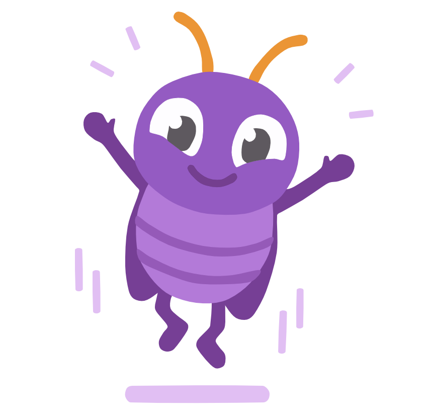
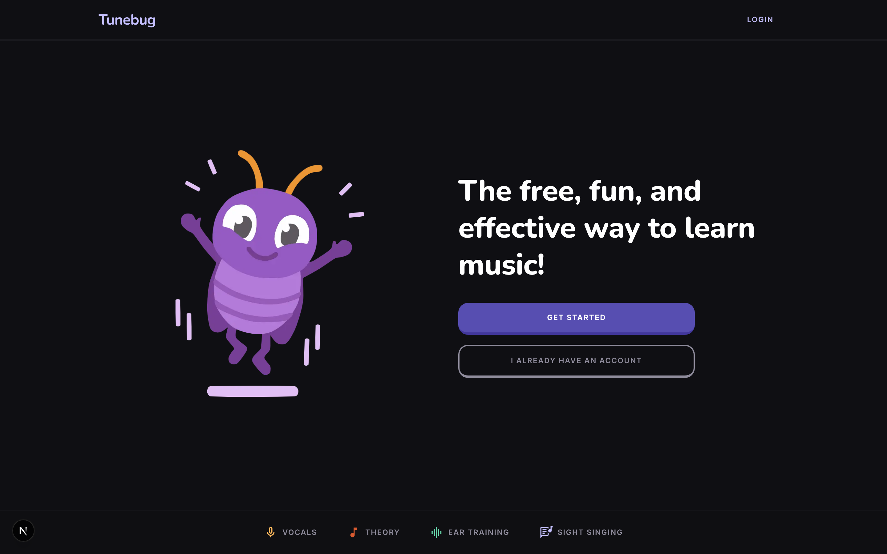
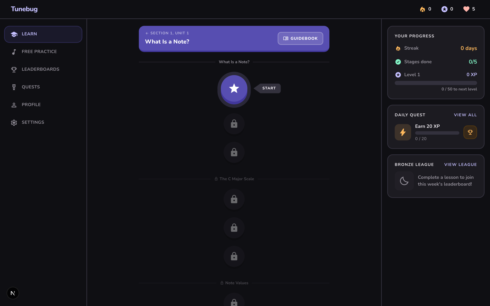
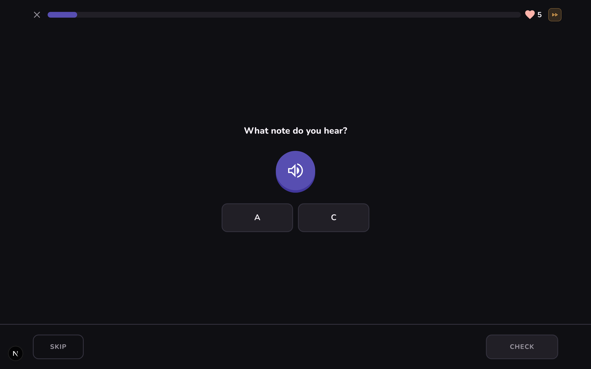
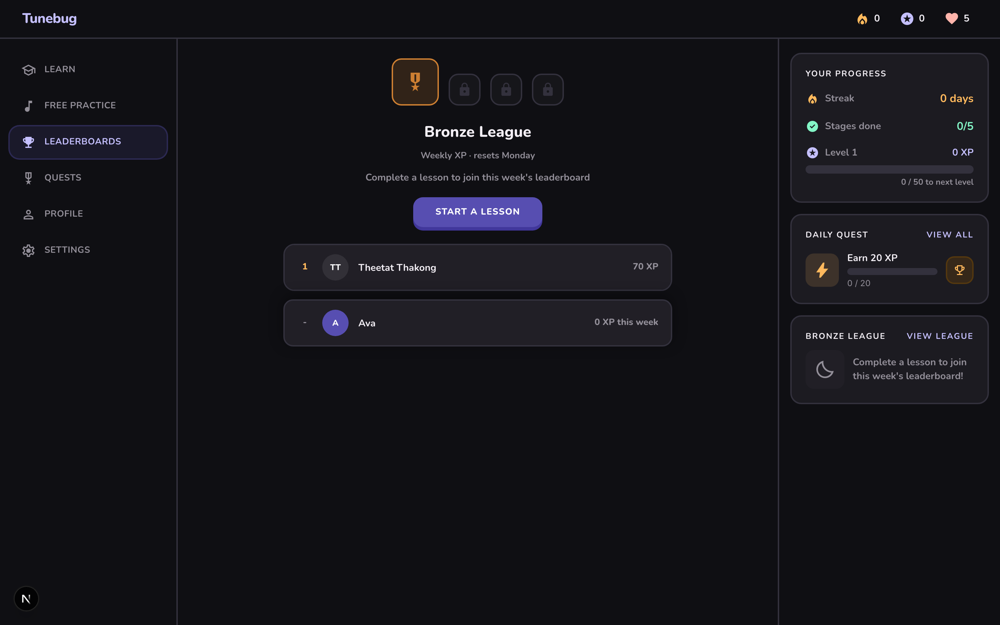
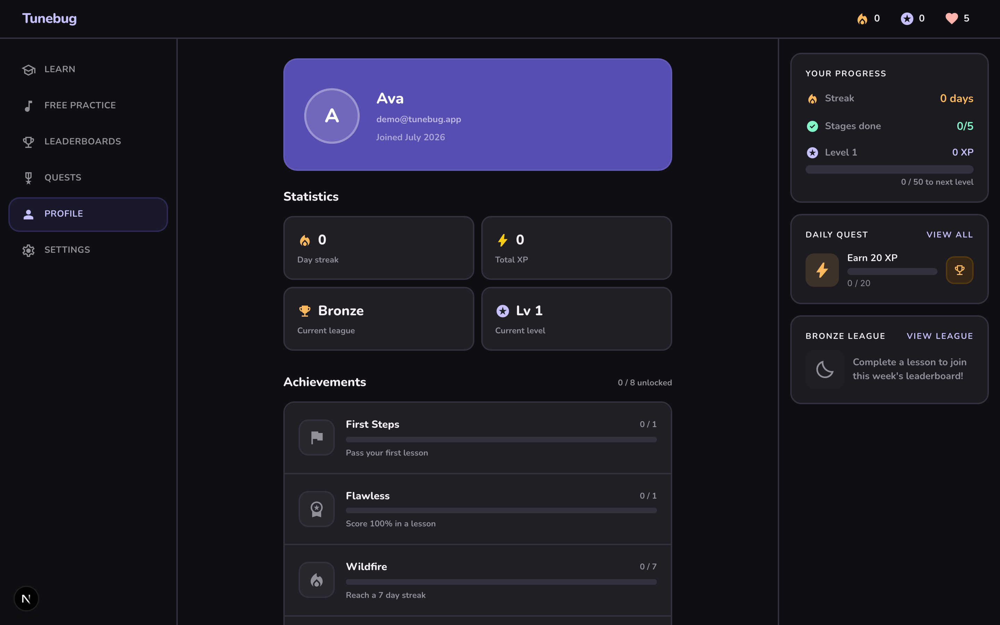
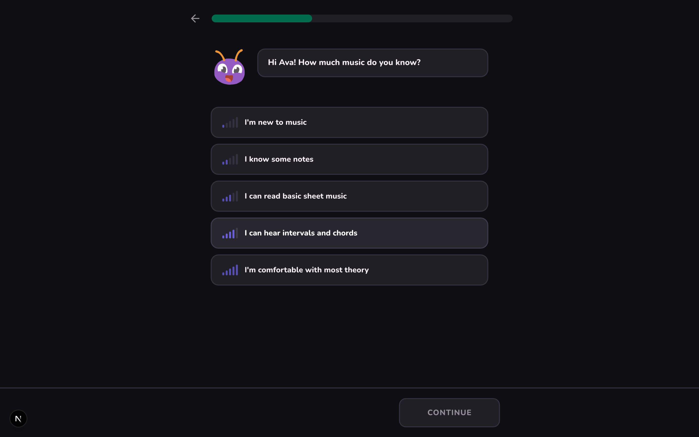
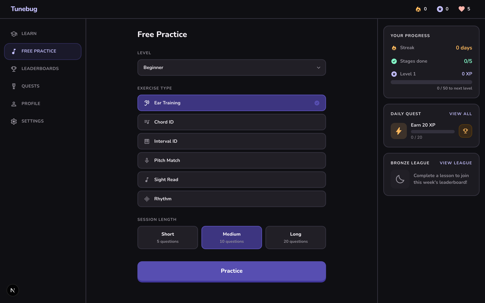

<div align="center">



# TuneBug

### The free, fun, and effective way to learn music by ear

Learn notes, intervals, rhythm, and pitch through bite sized lessons, daily
challenges, streaks, XP, quests, and weekly leaderboards. Think Duolingo, but
for your ears.


</div>

<br />

<div align="center">
  
</div>

<br />

## What is TuneBug

TuneBug turns music theory and ear training into a game. You start with a quick
placement survey, then climb a Duolingo style learning path made of stages,
units, and lessons. Every lesson is a short stack of exercises: hear a note and
name it, match a pitch with your own voice, identify an interval, read a bar of
notation, or tap out a rhythm. You earn XP, keep a daily streak alive, spend
hearts on mistakes, clear daily quests, and climb a weekly leaderboard against
other learners.

The whole thing runs as a standard web app. No native install, no background
workers, no websockets. Just open it and play.

<br />

## Features

### A learning path that unlocks as you grow

Lessons sit on a winding path grouped into stages and units. Finish a lesson to
light up the next node. A live progress panel tracks your streak, stages
cleared, level, and XP to the next level, while the daily quest and league
cards keep the next goal in view.

<div align="center">
  
</div>

### Twenty exercise types across four skills

The lesson runner mixes exercises so no two lessons feel the same. Every scored
answer feeds a spaced repetition mastery model that decides what to review next.

| Skill | Exercises |
| --- | --- |
| **Ear training** | Hear and name a note, name notes in a melody, identify intervals, same or different, higher or lower, odd one out, recall a sequence |
| **Pitch and voice** | Sing to match a target pitch, tracked live through your microphone |
| **Reading** | Read notes on the staff, name note values, spot the wrong note, pick notes on a keyboard, match pairs, true or false theory |
| **Rhythm** | Count the beats, tap along, build a rhythm, fill the missing beat, same or different rhythm |

<div align="center">
  
</div>

### Sing in tune with real pitch detection

The pitch match exercise listens through your microphone, folds octaves,
measures how many cents you are off the target, and holds a tuner needle steady
while you land the note. It uses [pitchy](https://github.com/ianprime0509/pitchy)
for detection and needs a secure context (localhost or HTTPS) for microphone
access.

### Gamification that keeps you coming back

- **XP and levels** reward every cleared lesson and daily stage.
- **Streaks** count consecutive practice days in your own timezone, so a late
  night session never costs you a streak to UTC.
- **Hearts** drain one per wrong answer and refill one every three hours.
- **Daily quests** pay claimable XP bonuses for hitting your goal.
- **Weekly leaderboards** rank public profiles by XP, resetting every Monday.
- **Achievements** unlock as you rack up XP and milestones.

<table>
  <tr>
    <td width="50%"></td>
    <td width="50%"></td>
  </tr>
  <tr>
    <td align="center"><b>Weekly leaderboard</b></td>
    <td align="center"><b>Profile, stats, and achievements</b></td>
  </tr>
</table>

### A placement survey that meets you where you are

New learners answer a few friendly questions about their background and how much
time they want to practice. TuneBug then either starts you from scratch or jumps
you ahead based on what you already know.

<div align="center">
  
</div>

### Free practice and account control

Practice any concept on demand outside the main path, and manage your account
from a profile that includes public leaderboard opt out, a full data export, and
account deletion.

<div align="center">
  
</div>

<br />

## Tech stack

- **[Next.js 16](https://nextjs.org)** (App Router) with React 19 and TypeScript
- **PostgreSQL** through **[Prisma 7](https://www.prisma.io)**
- **[NextAuth v5](https://authjs.dev)** with email and password (bcrypt) plus
  Google OAuth
- **[Tone.js](https://tonejs.github.io)** for audio playback,
  **[pitchy](https://github.com/ianprime0509/pitchy)** for microphone pitch
  detection, and **[VexFlow](https://www.vexflow.com)** for staff notation
- **[Tailwind CSS 4](https://tailwindcss.com)** with **[Framer Motion](https://www.framer.com/motion/)**
- **[Resend](https://resend.com)** for feedback and bug report email
- **[Vitest](https://vitest.dev)** and **[Playwright](https://playwright.dev)**
  for unit, component, database, and end to end tests

<br />

## Getting started

1. Install dependencies:

   ```bash
   npm install
   ```

2. Copy `.env.example` to `.env.local` and fill in the values (a local or hosted
   PostgreSQL database, an `AUTH_SECRET`, and optionally Google OAuth
   credentials).

3. Set up the database:

   ```bash
   npm run db:migrate   # apply migrations
   npm run db:seed      # load the curriculum (stages, units, lessons)
   ```

4. Run the dev server:

   ```bash
   npm run dev
   ```

   Open [http://localhost:3000](http://localhost:3000).

<br />

## Scripts

| Script | What it does |
| --- | --- |
| `npm run dev` | Start the dev server |
| `npm run build` | Production build |
| `npm start` | Serve the production build |
| `npm test` | Run the unit and component suites |
| `npm run test:db` | Run the database integration tests |
| `npm run test:e2e` | Run the Playwright end to end tests |
| `npm run verify` | Typecheck, lint, and run every test suite |
| `npm run lint` | ESLint |
| `npm run db:migrate` | Apply Prisma migrations (dev) |
| `npm run db:seed` | Seed the curriculum |
| `npm run db:studio` | Browse the database in Prisma Studio |

<br />

## Architecture

- **`app/`** holds the routes. Server components fetch data and pass
  serialisable props to client components. API routes live under `app/api/`.
- **`lib/curriculum/`** generates lessons and exercises: a seeded RNG, a concept
  slot generator, a spaced repetition mastery model, and a free practice session
  builder.
- **`lib/db/`** holds Prisma query helpers for progress, streaks, quests,
  achievements, the leaderboard, and daily stages.
- **`components/exercises/`** holds the twenty exercise types plus the lesson and
  stage runners. The pitch match exercise uses the microphone, so it needs a
  secure context.
- **`lib/api/rateLimit.ts`** is an in memory fixed window rate limiter. It is
  fine for a single node deployment. Swap it for a shared store such as Upstash
  Redis before scaling horizontally.

### Design system

TuneBug uses the "Sonic Progress" system: a Digital Violet primary
(`#574eb1` / `#7067cc`), a teal call to action (`#006c4e` / `#83f5c6`), tactile
3D buttons, and a dark theme (`#0F0F13`) reserved for the exercise screens.

<br />

## Testing

The suite spans four layers: unit tests for the music and curriculum logic,
component tests for exercises and runners, database integration tests against a
disposable Postgres instance, and Playwright end to end tests that drive real
lessons with a mocked microphone. Run everything with `npm run verify`.

<br />

## Deployment

Any Node compatible host works, and Vercel is the path of least resistance.

1. Provision PostgreSQL and set `DATABASE_URL` and `DIRECT_URL`.
2. Set `AUTH_SECRET` (a fresh one per environment) and `AUTH_URL` to the public
   URL.
3. Set Google OAuth credentials and add the deployment callback URL
   (`https://<domain>/api/auth/callback/google`) in the Google console, or omit
   them to run with email and password only.
4. Run migrations against the production database:
   `npx prisma migrate deploy`.
5. Seed the curriculum once: `npm run db:seed`.

<br />

<div align="center">


**Made for anyone who wants to train their ear, one lesson at a time.**

</div>
